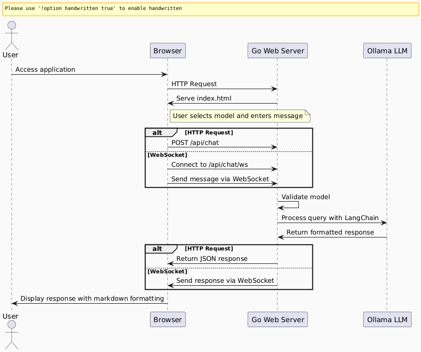
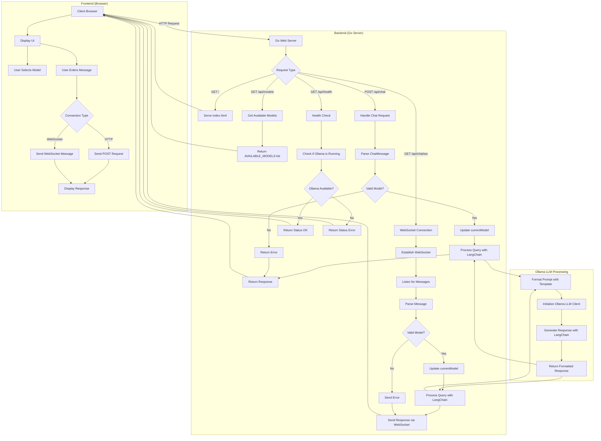

# Ollama AI Assistant 

## Table of Contents
- [Overview](#overview)
- [Features](#features)
- [Tech Stack](#tech-stack)
- [Supported LLMs](#supported-llms)
- [Quickstart](#quickstart)
    - [Getting Started with Ollama AI Assistant](#getting-started-with-ollama-ai-assistant)
    - [Step 1: Install Ollama](#step-1-install-ollama)
    - [Step 2: Pull a Model](#step-2-pull-a-model)
    - [Step 3: Run the Model](#step-3-run-the-model)
    - [Step 4: Use the Shell Script](#step-4-use-the-shell-script-optional)
- [Model Library](#model-library)
- [Customize a Model](#customize-a-model)
    - [Import from GGUF](#import-from-gguf)
- [Flow Chart Diagram](#flow-chart-diagram-for-ollama-ai-assistant-application)
    - [Explanation of the Flow](#explanation-of-the-flow)


<br>


### Powered by [Ollama](https://ollama.com/)


<p align="center">
  
  
</p>

# Overview
A sleek, modern chat interface for interacting with a variety of Ollama's large language models covering a wide variety of use cases.

This application provides a ChatGPT-inspired dark theme UI with proper code syntax highlighting and markdown support.


- Clean, responsive web interface with dark theme
- Support for multiple Ollama code models
- VSCode-style syntax highlighting for code blocks
- Markdown rendering for rich text responses
- Easy-to-use chat interface
- Ollama install and run shell script
  Located in: `use/runollam.sh`

### Tech Stack
- Go
- Java Script
- HTML
- CSS

### No web templates, frameworks or bloatware like Node.

# Features
### Supported LLMs
- [gemma3](https://ollama.com/library/gemma3)
- [qwen3](https://ollama.com/library/qwen3)
- [devstral](https://ollama.com/library/devstral)
- [deepseek-r1](https://ollama.com/library/deepseek-r1)
- [deepseek-coder-v2](https://ollama.com/library/deepseek-coder-v2)
- [llama4](https://ollama.com/library/llama4)
- [qwen2.5vl](https://ollama.com/library/qwen2.5vl)
- [llama3.3](https://ollama.com/library/llama3.3)
- [phi4](https://ollama.com/library/phi4)
- [mistral](https://ollama.com/library/mistral)

<br>

# Quickstart

## Getting Started with Ollama AI Assistant

This application provides a sleek interface for interacting with various Ollama models. Follow these steps to get up and running:

### Step 1: Install Ollama

If you haven't already installed Ollama, use our convenient script:

```shell
chmod +x install_ollama.sh
./install_ollama.sh
```

### Step 2: Pull a Model

To pull a model, use the following command. For example, to pull Llama 3.1:

```shell
ollama pull llama3.1
```

### Step 3: Run the Model

Once the model is pulled, you can run it interactively on the command line:

```shell
ollama run llama3.1
```

### Step 4: Use the Shell Script (Optional)

You can also use the included shell script to automate the selection and pulling of Ollama models:

```shell
chmod +x install_ollama.sh
./install_ollama.sh
```

<br>

### - _Before pulling a model number, keep in mind the memory constraints and limitations of your machine. Check the table below_

<br>

## Check the LLM details on Ollama's repo and web site:

###  _The following information is from [Ollama's GitHub](https://github.com/ollama/ollama) and is relevant to its use in this web scraper_

<br>

# Model library

**- Ollama supports a list of models available on [ollama.com/library](https://ollama.com/library 'ollama model library')**

**- Here are some example models that can be downloaded:**

| Model              | Parameters | Size  | Download                       |
| ------------------ | ---------- | ----- | ------------------------------ |
| Llama 3.1          | 8B         | 4.7GB | `ollama run llama3.1`          |
| Llama 3.1          | 70B        | 40GB  | `ollama run llama3.1:70b`      |
| Llama 3.1          | 405B       | 231GB | `ollama run llama3.1:405b`     |
| Phi 3 Mini         | 3.8B       | 2.3GB | `ollama run phi3`              |
| Phi 3 Medium       | 14B        | 7.9GB | `ollama run phi3:medium`       |
| Gemma 2            | 2B         | 1.6GB | `ollama run gemma2:2b`         |
| Gemma 2            | 9B         | 5.5GB | `ollama run gemma2`            |
| Gemma 2            | 27B        | 16GB  | `ollama run gemma2:27b`        |
| Mistral            | 7B         | 4.1GB | `ollama run mistral`           |
| Moondream 2        | 1.4B       | 829MB | `ollama run moondream`         |
| Neural Chat        | 7B         | 4.1GB | `ollama run neural-chat`       |
| Starling           | 7B         | 4.1GB | `ollama run starling-lm`       |
| Code Llama         | 7B         | 3.8GB | `ollama run codellama`         |
| Llama 2 Uncensored | 7B         | 3.8GB | `ollama run llama2-uncensored` |
| LLaVA              | 7B         | 4.5GB | `ollama run llava`             |
| Solar              | 10.7B      | 6.1GB | `ollama run solar`             |

> [!NOTE]
> You should have at least 8 GB of RAM available to run the 7B models, 16 GB to run the 13B models, and 32 GB to run the 33B models.

## Customize a model

### Import from GGUF

Ollama supports importing GGUF models in the Modelfile:

1. Create a file named `Modelfile`, with a `FROM` instruction with the local filepath to the model you want to import.

   ```
   FROM ./vicuna-33b.Q4_0.gguf
   ```

2. Create the model in Ollama

   ```
   ollama create example -f Modelfile
   ```

3. Run the model

   ```
   ollama run example
   ```


# Flow Chart Diagram of Ollama AI Assistant Application


<p align="center">
  
</p>




## Explanation of the Flow

1. **Client Interaction**:
    - User accesses the application through a web browser
    - The frontend loads the UI with a model selector and chat interface
    - User can select a model from the dropdown menu and enter messages

2. **Request Handling**:
    - The Go web server handles different types of requests:
        - Serves static files (HTML, CSS, JS)
        - Provides API endpoints for models, chat, and health checks
        - Manages WebSocket connections for real-time chat

3. **Model Selection**:
    - Available models are defined in the `AVAILABLE_MODELS` array
    - The frontend displays these models in a dropdown
    - When a user selects a model, it's sent with the chat message

4. **Chat Processing**:
    - Messages can be sent via HTTP POST or WebSocket
    - The server validates the requested model
    - If valid, it updates the current model
    - The message is processed using the Ollama LLM through LangChain

5. **LLM Integration**:
    - The system formats the prompt using a template
    - Initializes the Ollama LLM client with the selected model
    - Generates a response using LangChain
    - Returns the formatted response to the client

6. **Response Handling**:
    - The response is sent back to the client
    - For HTTP requests, it's returned as JSON
    - For WebSocket connections, it's sent as a text message
    - The frontend displays the response with proper markdown formatting and syntax highlighting

This flow chart illustrates the complete lifecycle of a user interaction with the Ollama AI Assistant application, from model selection to receiving AI-generated responses.