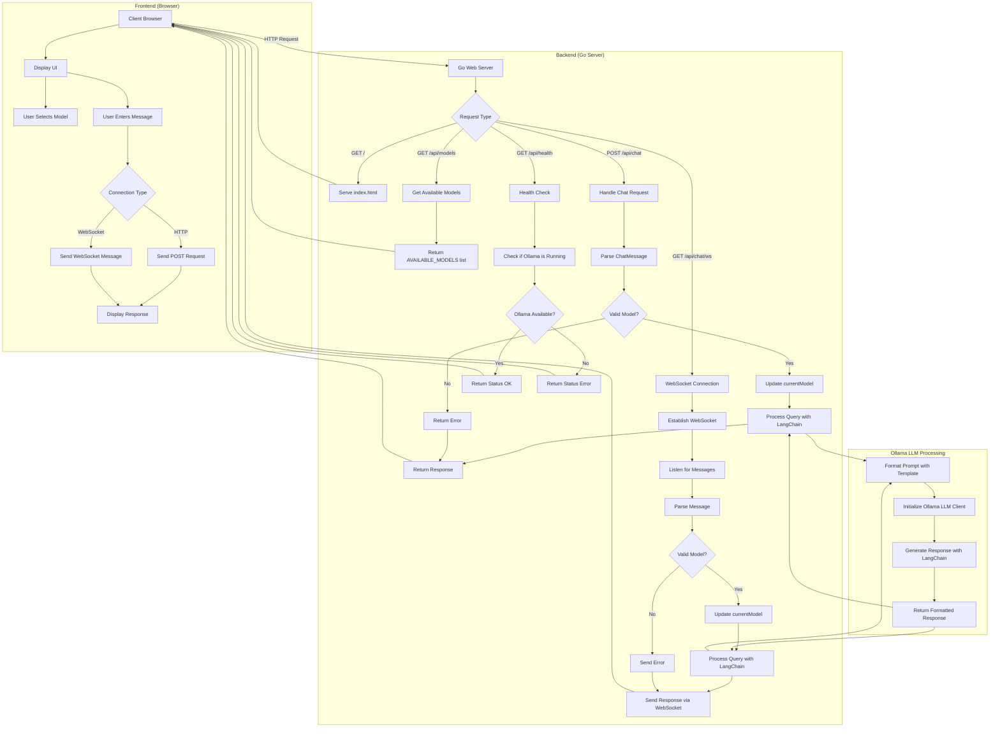

# Flow Chart Diagram for Ollama AI Assistant Application

Here's a flow chart diagram that illustrates how the Ollama AI Assistant application works:

## Explanation of the Flow

1. **Client Interaction**:
    - User accesses the application through a web browser
    - The frontend loads the UI with a model selector and chat interface
    - User can select a model from the dropdown menu and enter messages

2. **Request Handling**:
    - The Go web server handles different types of requests:
        - Serves static files (HTML, CSS, JS)
        - Provides API endpoints for models, chat, and health checks
        - Manages WebSocket connections for real-time chat

3. **Model Selection**:
    - Available models are defined in the `AVAILABLE_MODELS` array
    - The frontend displays these models in a dropdown
    - When a user selects a model, it's sent with the chat message

4. **Chat Processing**:
    - Messages can be sent via HTTP POST or WebSocket
    - The server validates the requested model
    - If valid, it updates the current model
    - The message is processed using the Ollama LLM through LangChain

5. **LLM Integration**:
    - The system formats the prompt using a template
    - Initializes the Ollama LLM client with the selected model
    - Generates a response using LangChain
    - Returns the formatted response to the client

6. **Response Handling**:
    - The response is sent back to the client
    - For HTTP requests, it's returned as JSON
    - For WebSocket connections, it's sent as a text message
    - The frontend displays the response with proper markdown formatting and syntax highlighting

This flow chart illustrates the complete lifecycle of a user interaction with your Ollama AI Assistant application, from model selection to receiving AI-generated responses.